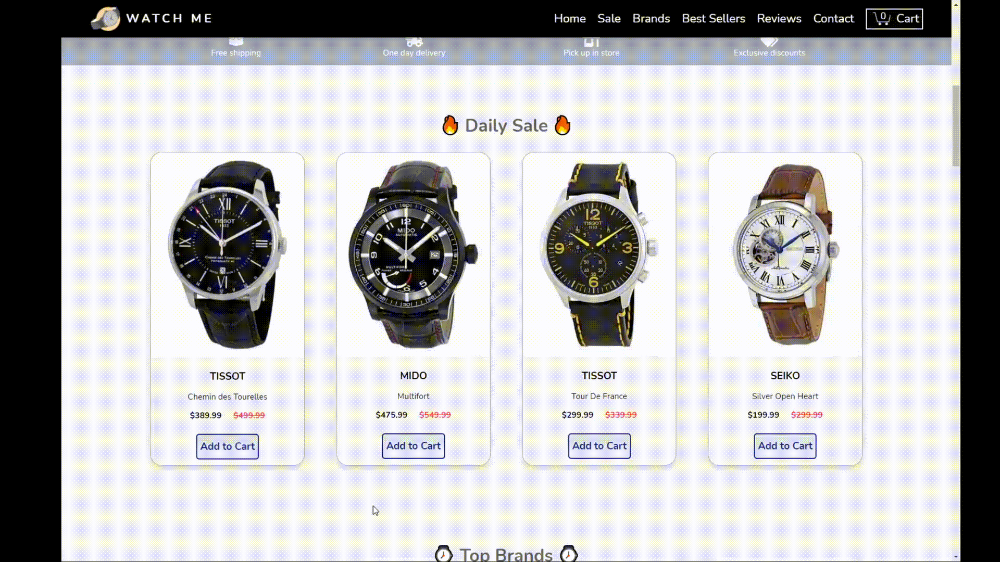

# ⌚ Front-end E-commerce store for selling watches ⌚
Link to live site: https://juanscanlan.github.io/watches-website/

<b>Languages and Tools used:<b> 
  
   
  
  
  
  
  
  
 
  
## 🛒 Preview: Shopping Cart Demo 🛒
  (Open image in new tab for more clarity) 

## 📄 Preview: Full Site 📄

